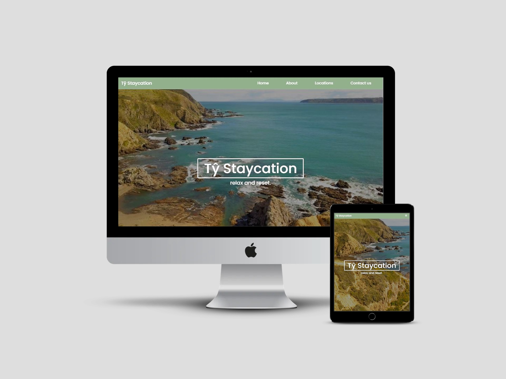
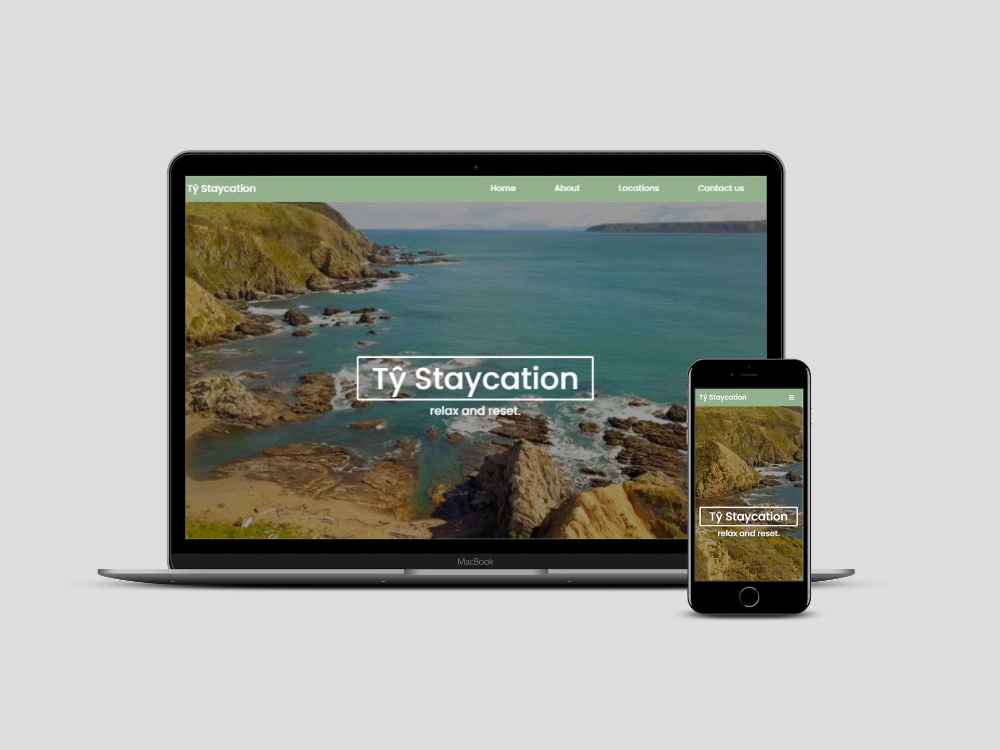
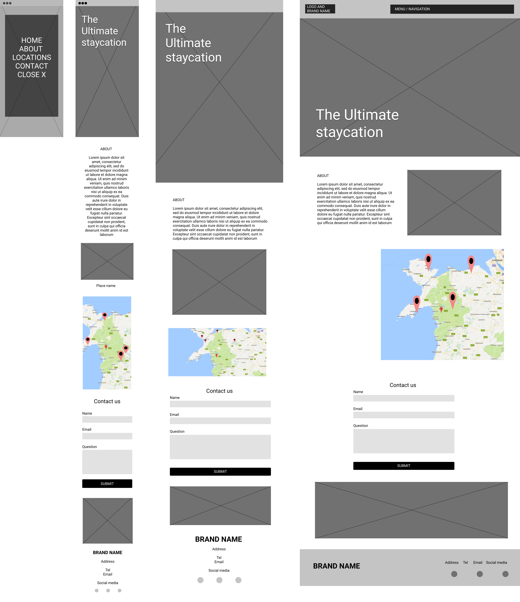
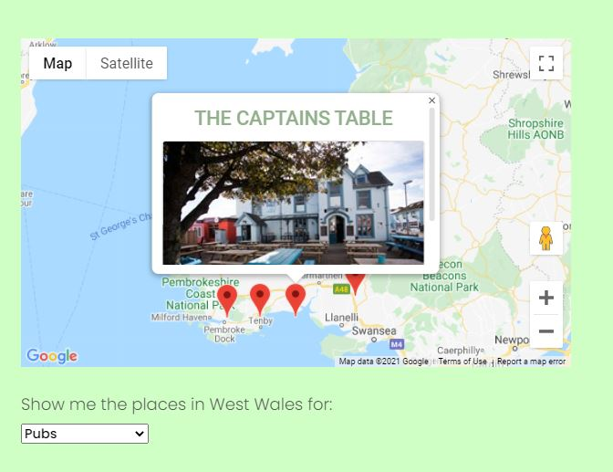
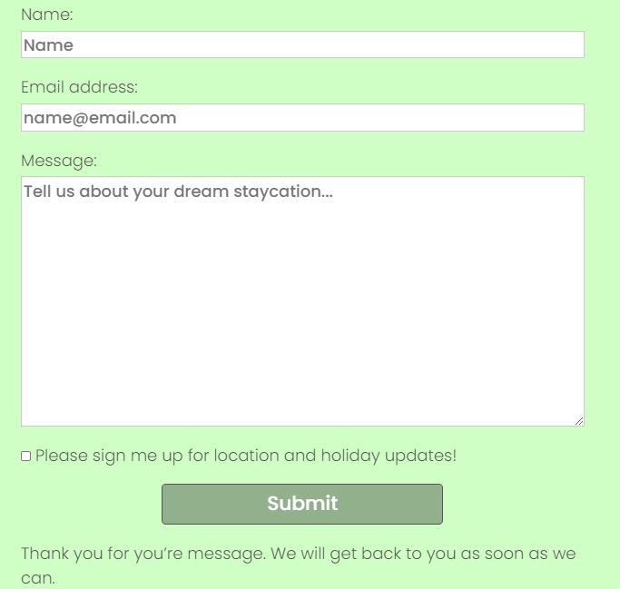
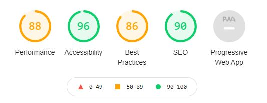

# Tŷ Staycation 

View the live project here: [Tŷ Staycation]( https://sophnagle.github.io/staycation/.)

I have created an interactive website for a fictional travel company, Tŷ Staycation, that showcases the companies holiday homes and local amenities in the Pembrokeshire area of the Welsh Coast via a Google map where users view these properties and amenities and can contact the company for further information and to book a trip. 

Main Use case: Browse local holiday destinations and local amenities and contact the company to book a trip. 

External user goal: The site’s main users, and derived from the main use case, are for British or Welsh residents looking to book a short break. They are in the demographic of young professional to older person that may not be a digital native or tech savvy. This means the site should be intuitive and give clear feedback on user’s interactions.  

Site owner/business goal: The brand wants to increase conversion and have clients book trips through them. They want to provide full information about their properties and what the surrounding areas have to offer clients in terms of landmarks and amenities so they can book the most appropriate trip for them. They want the information to be clear and intuitive and the site to be a friction-free experience. 

As more than 70% of users browse and purchase via mobile phones, the site has been designed with a mobile first approach and remains responsive. The site is a continuous scrollable page with 5 sections; 1) it includes a landing page with a video brand logo and call to action and global top navigation, 2) an about section which describes the companies offering, 3) an interactive google map where users can view company properties and select and view different amenities via a dropdown selection menu, 4) a contact us form where users can contact the brand about the properties and areas and book a trip, 5) a footer with contact information that takes them to direct email, phone call and social media links.

### Navigation and Landing Page 

[Landing page](https://sophnagle.github.io/staycation/#landingPage ) 

I have created the site with conventional global navigation to suit the multiple user demographics and technical capabilities, as its better to stay within convention for intuitivity. The menu options take the user through the key sections of the site. 

Throughout I have included scroll icon arrows suggesting the site requires scrolling for more content. This is so the user can navigate through the site smoothly. There is also a scroll to top clickable icon at the bottom, again for ease for the user to save scrolling. 

The navigation is responsive and at small devices includes a hidden slider menu to make room for the website content. A user can scroll through the page or click the menu and bring the menu options down. 

The landing page is purposefully simple. A slow drawing back pan video of the Pembrokeshire coast is overlaid with a large brand logo and a statement of the brand’s ethos, relax and reset, which like a call to action is clickable and links the user to the about section. The video was chosen for both its content and slow aesthetic evoking the relaxed nature of this holiday brand. A fade in effect made in JavaScript drives users through the site and the slow speed mirrors the slow speed of the video giving a feeling of serenity. 

### About Us

[About us]( https://sophnagle.github.io/staycation/#about) 

This section is an introduction to the company and explains that it offers various rental holiday homes in West Wales that users can book. I have split the screen in half, with text explaining what the company offers on the left and an image on the right. This split is a UX technique to guide the user’s gaze through the page. The image of the sheep was specifically chosen for it’s Welsh and countryside connotations. 

### Google Map and dropdown selection

[Locations]( https://sophnagle.github.io/staycation/#locations) 

Here, I have used the Google Map API to show a map focused on West Wales with markers to show the company’s holiday homes. In addition, I have provided a dropdown menu of various amenities a user would look for on a holiday, which they can click on (Pubs, Beaches, Walks, Restaurants and Family Days), upon which relevant new map-markers will appear. For example, if the user selects ‘Beaches’ on the dropdown options, the map will reset showing markers of local beaches. 

When a user clicks a marker, an info window appears with the title of the property and an image which is clickable and takes the user to an external page with more information about these sites. I have used JavaScript functionality from the API to create these markers and used custom code I made to build the dropdown menu. The links take users to the external sites in a new tab so the user does not lose this website. 

Alongside the map is a short description inviting the user to click the map and browse the dropdown menu to view their property options and then see what amenities are available in different areas and help them pick the best place and type of holiday break that they want. 

### Contact Us

[Contact us]( https://sophnagle.github.io/staycation/#contactUs) 

Then there is a contact area. There is a contact form that a user can request a holiday booking with the details of the properties they find on the, or alternatively use it to ask any questions. This is fully interactive, using EmailJS giving the user feedback if completed incorrectly or a section is missed and sends an email to the email address tystaycation@gmail.com.

Within this section there are images of brands that review and endorse the fictional travel company. They are displayed spherically with text advising the are endorsers. This has been placed next to the contact form to convey the fictional company’s reliability and security.

### Footer

The footer has the contact information of the brand, with a direct link to call and email the company as well as address details. It also includes social media links that when clicked take the user to an external page so this website isn’t lost. 

---

## User Experience (UX)

* Strategy Plane

The site displays the travel company’s rental properties in West Wales. The purpose of the site is to show the user these properties, allow them to browse the best amenities in the nearby area therefore entice them into wanting to book a trip and then ask to book via the contact form. 

According to research, the majority of users choosing to travel locally within their home of the UK are between 25 – 60, with most within this range at 45-54. People choosing to have a coastal or country break tend to reside in inner cities and want comfortable holidays surrounded by a choice of potential activities and places to visit when they arrive. In the last year there has been an 8% increase in the uptake of staycation trips over visiting abroad meaning more and more people are looking to book these trips. A lot of this is because of the recent pandemic where people are worried about travel safety, financial circumstances and wanting to help the economy by keeping spending here. 

The age of the demographic is varied and will include many who might not be particularly tech-savvy. The site has been made so that it is very intuitive with global navigation, a fade-scroll to encourage discover and scroll icons to help the user too. The design is simple with the key elements of the map and contact form easy to find. The text through the site explains the companies offering, how to interact with the map and how to book a trip so it’s all there for users.

User goal: To find and book a suitable UK based holiday destination to suit my interests and needs. I want to see pictures of the holiday homes, different types of residences and see what activities/amenities are available nearby.

Business goal: To get the user to choose a property package from its site and book through the contact form. 

[Report: The Rise of Staycations – UK Travel in 2020/21](https://www.schofields.ltd.uk/blog/5980/staycations-uk-travel-2020-21/)

### Competitive benchmark

What is the companies USP? 

There are many holiday home websites that showcase their properties or land that is available to rent. Here are the key ones that I have benchmarked against to design this site:

[West Wales Holiday Cottages](https://westwalesholidaycottages.co.uk/things-to-do/category/beaches)

This site segments amenities by type, E.G beaches, gardens, food, etc and then by location. This site has all the information present at once which come across as quite overwhelming and difficult to find the information you want. The goal of the site it to allows the user to fully understand what is in the surrounded area and therefore what they can do on their trip which shows the user there is a lot of choice and entices them into booking a trip. This is that type of data I want to show but I want to do it via a drop down so the user can view the places by their selected choice making the information much easier to digest. 

[Visit Wales](https://www.visitwales.com/)

This site has large, bold and engaging images. They have lots of clear white space and let the user glide through the images. Again, I find the information a little overwhelming as there’s no hierarchy or arrangement to it on the landing page. This site breaks down the information (places to stay and things to do) via its global navigation. This shows that businesses know these are things users look for in their sites. However, I think this lacks interactivity and a contemporary enticing aesthetic. 

[Glamping Hub](https://glampinghub.com/rentalsearch/staycations-wales-uk/?q=&checkin=&checkout=&adults=2&children=0&infants=0&lang=en&page=1&sort=recomended&currency=USD&filters={%22categories%22:[],%22features%22:[],%22flags%22:[],%22genericCollection%22:%22Collection-164%22}) 

This website is location specific and has an interactive map on the right-hand side, with places to stay linked on the left. The user selects a location on the map and the information appears on the left. This has lots of white space and has lots of imagery of the places to stay, this really allows these to sing. They have drop downs for types of properties and is focused on property type rather than by local amenities. It also includes a date checker which is great for users. This is much more interactive than the previous two examples therefore users can really determine what information they get from the site. The date checker is a fantastic tool for usability as well. 

[Forest Holidays](https://www.forestholidays.co.uk/types/)

This website has a feature where you can select the type of holiday you would like, and on that link would suggest locations and additionally other similar places that you may like. For example, if a user selects ‘Hot Tub holidays’ it has a banner at the bottom of the screen that showcases the results for romantic holidays. This allows the site to expose the user to more options, increasing the likelihood of conversion. However I find the landing page of this site very text heavy and not very exciting. 

From this brand comparison, it is apparent that a common trait is searching for various amenities in nearby area via an interactive map. They show images of the property or landmark to show the user. This is key it will have to be made very intuitively for the user so as they are not overwhelmed and remain excited about a holiday.  

Key tasks/cases for the site are as below in this strategy trade off: 

|   | Features | Importance | Viability |
| :-: | --------------------------------- |:-------------:| :--------:|
| A | Interactive Map | 5 | 5 |
| B | Show amenities by area | 4 | 4 |
| C | Information about the company | 5 | 5 |
| D | Contact form for bookings and enquiries | 4 | 5 |
| E | Images of locations and amenities | 5 | 5 |
| F | Booking and payment platform | 3 | 1 |
| G | Calendar date checker | 3 | 1 |
| H | Increase local tourism | 3 | 2 |
| I | Increase digital presence | 3 | 1 |
|   |  *Total* | *35* | *29* |

As the importance is higher than the viability this is going to work. The features that are that are the most important and achievable are: 

* Brand information
* Interactive Google Map
* Interactive amenities shown (via dropdown and JS function)
* Contact form for bookings and enquiries.
* Images 

An interactive payment terminal and calendar checker although would be great for usability are not viable for this site at this time. 
 
From the point of view of the user, they expect to have a clear, consistent and professional website that allows to see who is this travel company, why is it reliable, where are the best local amenities and what do they offer. The user, considering the target that the website aims to, is not interested in saving money, but in having a great experience. 

Navigation should be intuitive and simple. Global navigation will be used for conventionality and therefore intuivity. A fade in scroll will guide users into scrolling down through the site and scroll icons will assist in this as a backup. 

This website should have a map, which I will do using Google Maps API with markers and info windows. These info windows will hold the image of the location/amenity, its name and an external link to that site for the user to browse further. A dropdown menu of various amenities will allow the user to control the information that they see on the map, rather than display everything at once. 

Logos of travel brands and the welsh government are used to showcase the companies trustworthiness. 

A holiday can be booked via contact form where the user makes their request. EmailJS will allow for direct emails to be sent via a form in the site to the company’s email address. User’s can also get in touch via email, phone or postal address. Social media links allow users to connect also.  

* Scope Plane 

Based on the strategy plane, the key features that are the most important for users and the most achievable are providing direct information about the brand and the service, an interactive map that shows properties by location, amenities’ shown on the map as selected by the user and a contact form so that the user can book a trip. 

The site needs to appear trustworthy and intuitive. It wants to be as helpful as it can to users by providing them with lots of information whilst also achieving high sales conversion and bookings. The company requires a website that expresses its professionality, reliability and trustworthy. The agency wants to gain new clients, but also have a digital presence.

The best locations and amenities will be included through the info windows on the map and holidays can be booked via a contact form. A date checker, direct booking and payment terminal is not viable for this release but open to addition at a later time.  

The website must be a clear showcase of their brand. It should have contemporary features and aesthetic. 

* Structure Plane

Of the key elements that were determined important, they should be put in this exact logical order on the site: 

* Information about the brand’s service
* Interactive map with locations
* Dropdown of options for user to select various amenities and view on map 
* Contact form – so the user can request to book a trip after seeing the locations 

They will form one scrollable page with navigation at the top and scroll icons so the user can navigate through at anyone time. 

The user needs to understand the brands service, only then can it explore the service holiday homes and amenities and following this they can request to book the trip. The map and dropdown menu are clearly related and therefore need to be near each other for the user to assume this relationship. 

Feedback will inform the user if they have not completed the form validly or missed a field. When the user submits their request, text appears thanking them for their submission giving the user feedback that the form has been sent. 

Links change visual style on hover, so that a user knows that they can click on it for more content or an action.

For the links that lead to an external page (e.g social media or amenity websites) will open in a new tab, so the user will not be navigated off this site. 

Evolving from the Structure plane, the about information will be in text and kept brief just explaining the companies core mission. A bold image will sit aside it to add visual interest to the overall screen but in keeping with the brand. 

Following this explanation, and the user’s understanding, will be the interactive map. This has the markers showing the company rental properties so the user can see the different options in different areas, and then underneath, so its clearly, related is a dropdown menu of various amenities (Pubs, restaurants, beaches, walks, family landmarks) where on the user’s selection, the map will show those particular amenities on the map. 

From exploring the area and nearby landmarks is a contact form that allows the user to request a holiday booking or pose a query.

Around these elements will be short text to indicate as to their required actions. For example above the contact form is the text “For a tailored experience at the highest level of care, please contact us with your Tŷ Staycation request and we will arrange it for you.” 

The interactive components also provide feedback to the user. The map hides and shows location markers as chosen by the user. The contact form is fully usable and an email is sent to tystaycation@gmail.com on submit. A message appears to notify the user of submission as well. All formfields are marked as required and validation is applied so that if they are not populated the site requests the user to complete it. 

The website is a single scrollable page with 5 sections. These can be scrolled to instinctively by the user, but also navigated to through a drop-down navigation menu that is fixed to the top of the viewport. I have also included scroll icons through the page as an extra component to inform the user there is more information below. A scroll to the top icon is above the footer too, so the user can quickly go back to the top of the page without scrolling. Links change style on hover so a user knows that they can click on it for more content or to move about the page. Links that lead to an external page, such as the social media links, will be opened in a new tab so as not to lose this site. The contact form has key placeholders and labels so the user knows what information to input.

* Skeleton Plane 

I have used Figma to design the layout. My wireframes can be viewed here: 

 

The sections will each have the same visual style for consistency. They will have the same background colour, the same typography, and a similar percentage content, padding and margins. Components will have enough space around them to breath and remain digestible for users. 

It will be designed responsibly, mobile first, so that these components are visually consistent across devices but suitable for that screen. 

The final design altered slightly from the original wireframes through development. 

* Surface Plane

The colour palette is inspired by natural green colours associated with Wales and it’s landscape. White and grey font colours are used as accessible against the background and alternate on hover. 

The Google Font ‘Poppins’ was used for its contemporary and stylish aesthetic. It is legible and professional, and its sans-serif characters are modest and doesn’t distract from the site components. 

Headings, text, images and components are designed with a relevant size to work in harmony and to be sufficient in their own right. 

I created a fade in on scroll in JavaScript to add a smooth transition as the user scrolls down the website. This adds an element of discovery and encourages the user to scroll down the site. 
Sources of design research came from Dribble, Pinterest and UXPlanet (to name a few). Brands that showcased staycations and local travel were researched. A common convention is simple minimal design with a map and images capable of standing out. 

[UX Planet](https://uxplanet.org/booking-a-vacation-using-your-emotions-148546a66e83)
[Dribble]( https://dribbble.com/tags/staycation?s=popular) 

### User stories 

First time user goals: 

* I want to understand more about what staycations are. 
* I want to book a holiday break in the UK. I want to see various holiday homes and what is around the nearby area. 
* I want to speak to someone about booking a potential trip.  

Returning visitor goals:

* I want to speak to someone about a trip I would like to book.  
* I have a query about a trip that I have already booked.  
* I want to find out if there are new properties I could stay at and/or new amenities that they recommend.

The main features as required by these user-stories are the interactive map, that shows the companies properties and local amenities, and a contact form as can seen in the below screenshots. 

### Design 

I have used a single page layout for ease of finding information altogether. I wanted the site to have a relaxed feel whilst also enticing users. From comparative research I wanted to use imagery of the area and locations as a key part of the design with a minimal layout and design behind this. 

The landing page has an overlay of the brand logo with a video of the Pembrokeshire coast underneath. Its visual engaging and interesting. 

I have used JQuery’s animate effect on scroll to achieve a sense of serenity through the page through fading in. This glide is a nice continuation from the slow pan in the landing page video. 

### Colours

I used Google’s Material Design guidelines, Adobe Colour Wheel to test colour palettes. 

[Google Material Design](https://material.io/design/color/the-color-system.html#color-usage-and-palettes)

[Adobe Color Wheel](https://color.adobe.com/create/color-wheel) 

The colour scheme is inspired by the green tones in the video and was chosen for it’s Welsh and countryside connotations. This is so for the user it has associations with holidays immediately. 

White and grey font colours are used for text and hovering over actionable elements as modest yet legible choices. They were tested for accessibility and passed. 

The navigation is a slightly darker variation of the body colour to keep consistent. 

The contact form changes colour when populated to let user know there is content there. This is a slightly darker grey than it’s original colour. 

### Typography

I used Google Font’s ‘Poppins’ as it is contemporary and stylish. Its lightweight, thin characters compliment the website aesthetic and work for titles as well as text. It’s sans-serif characters are legible and modest. I used a light font-weight too to compliment that contemporary aesthetic. 

Different font sizes were used for the various heading types (H1, H2..etc) and text as hierarchy dictates. 

### UI Design, Imagery and videos

The landing page video was taken from [Pexels](https://www.pexels.com/video/drone-footage-of-a-rocky-coastline-4070791/ ). It is a slow video of a beach in the Pembrokeshire coast, in keeping with the sites offering. 

The images of the locations and amenities have been taken from their websites: 

* Places to Stay 

[Fforest Farm]( https://www.coldatnight.co.uk/fforest-farm/)

[Cwtch]( https://westwalesholidaycottages.co.uk/cwtch)

[The Coach House]( https://www.fbmholidays.co.uk/cottages/tenby/the-coach-house)

[Griffithston]( https://www.ukcampsite.co.uk/sites/details.asp?revid=7804)

[One Cat Farm]( https://www.onecatfarm.com/booking-prices-availability/the-hide/)

[Fron Haul](https://westwalesholidaycottages.co.uk/fron-haul)

[Rhosgadw farm campsite](http://www.campingstdavids.co.uk/)

* Pubs 

[The Jolly Sailor]( https://www.jollysailorburton.co.uk/)

[The Black Lion]( https://blion.co.uk/)

[Ffostrasol Arms]( https://ffostrasolarms.co.uk/)

[The Griffin]( https://www.griffininndale.co.uk/)

[The Old Chemist Inn]( https://www.tripadvisor.co.uk/Restaurant_Review-g191268-d1395495-Reviews-The_Old_Chemist_Inn-Saundersfoot_Pembrokeshire_Wales.html) 

[The Captains Table]( https://thecaptainstable.co.uk/index.html)

[Hope and Anchor](https://www.thehopeandanchorpub.co.ukhttps://www.tripadvisor.co.uk/Restaurant_Review-g191253-d1529378-Reviews-Hope_Anchor-Tenby_Pembrokeshire_Wales.html)

* Restaurants

[Blue Ball Restaurant]( https://www.blueballtenby.com/) 

[Coast]( https://coastsaundersfoot.co.uk/) 

[Ultrocomida]( https://www.ultracomida.co.uk/page/venues/narberth) 

[The Canteen]( https://www.thecanteennewport.com/) 

[The Mill]( https://www.tripadvisor.co.uk/Restaurant_Review-g552052-d4513699-Reviews-The_Mill-Trefin_St_Davids_Peninsula_Pembrokeshire_Wales.html) 

* Beaches 

[Tenby]( https://www.visitwales.com/destinations/west-wales/pembrokeshire/things-do-tenby) 

[Saundersfoot]( https://www.visitpembrokeshire.com/explore-pembrokeshire/beaches/saundersfoot) 

[Llangranog]( https://www.thebeachguide.co.uk/south-wales/ceredigion/llangrannog.htm) 

[Aberporth]( https://www.cardigan-bay.com/aberporth-beach-cardigan-bay/) 

[Tresaith]( https://www.cardigan-bay.com/tresaith-beach/) 

[Mwnt]( https://www.nationaltrust.org.uk/mwnt) 

* Walks

[Caldy Island]( https://www.countryfile.com/go-outdoors/walks/walk-caldey-island-pembrokeshire/) 

[Marloes]( https://www.countryfile.com/go-outdoors/walks/walk-marloes-peninsula-pembrokeshire/) 

[Dyffryn Fernant]( https://www.countryfile.com/go-outdoors/walks/walk-dyffryn-fernant-garden-pembrokeshire/) 

[Tenby]( https://www.countryfile.com/go-outdoors/walks/walk-tenby-pembrokeshire/) 

* Family

[Oakwood]( https://www.oakwoodthemepark.co.uk/) 

[Folly Farm]( https://www.folly-farm.co.uk/) 

[Danyrogof Caves]( yha.org.uk/experience/national-showcaves-centre-wales) 

[Botanical Gardens]( https://botanicgarden.wales/) 

[Dinosaur Park]( https://www.thedinosaurpark.co.uk/) 

[Welsh Chocolate]( https://www.wickedlywelsh.co.uk/) 

The sheep image was taken from the stock image website [Unsplash](https://unsplash.com/photos/zv9yI6jh00Q). 

Logos were taken from the brand websites. 

All images have alt text. 

###Wireframes 

The initial design was created in Figma, with small iterations as it was built and tested as seen in the Skeleton section of this document. 

### Features

The website has a simple layout with all the key components displayed responsively. There is a navigation bar, a landing page, about section, an interactive map, a contact form and a footer with all the links to connect with the brand. I have checked the responsiveness on all devices through Devtools so that everything works together, is aligned correctly and retains full clarity with no pixilation. Bootstrap was used was the website layout, navbar and info card windows on the map. 

An interactive map is key and shows the locations and local amenities. 

The contact form uses emailJS to receive requests from users and provides feedback if a user does not populate correctly as well as success feedback when the form is submitted.  

### Features to implement 

As per the UX strategy scope, I think the site would be improved with a payment terminal and a date calendar checker. This would require further time to implement. A booking form would be part of a future release and could be made with the booking.com API. 

The card windows that host the information about the places to stay and amenities could be larger or include slide show to give users further visual information about these places. Again, this improvement in UX can be added at a future release. 

The function design of the interactive map means that the travel company can add any new rental properties or amenities to the site as needed. This can continue both inbetween and in new releases. 

An additional feature to add is a custom page 404. Something custom designed in keeping with the website helps the brands presence in making it appear more trustworthy and knowledgeable. 

--- 

## Technologies 

### Languages 

* HTML5
* CSS3
* JavaScript

### Frameworks, libraries, and software used

* Google Map API
* EmailJS
* Bootstrap 4.5.0
* Google fonts
* Font Awesome 4.7.0
* Google Material Design
* Figma
* jQuery
* Git
* GitHub
* GitPod
* Chrome DevTools
* Lighthouse

---

## Testing 

### Functionality 

All navigation, map dropdowns, marker card windows and social links have been checked and they are all working. 

The Map markers all work, all the links have been tested, take the user to external sites and the images function. When a user selects the drop-down options, the map correctly displays the relevant options. 

The contact us form has been tested by myself and several others. The validation feedback works correctly, and the emails are successfully received to tystaycation@gmail.com. On a submission a successful message appears thanking the user for their submission and that someone will get back to them. 

The scroll functions smoothly and the site has been tested for responsivity using DevTools. 

The HTML and CSS were validated with [HTML Validator](https://validator.w3.org/)  and [CSS Validator](https://jigsaw.w3.org/css-validator/).

HTML: errors found and rectified throughout. These often included misaligned div containers. 
CSS: typographic errors found and rectified throughout. 

The JavaScript files were run through [JSHint}(https://jshint.com/). Some variables were flagged in the EmailJS file, however this is as per the EmailJS instructions. There were no errors.   

I tested JavaScript while compiling using console.log to check if the code and functions were being called correctly. 

Whilst creating the functionality for the dropdown menu, I expected the function to locate and use the array as per the ‘value’ however it didn’t take and just used the same one each time. After testing in the console to see what function was being called and where the issue was coming from I noted that the file required moving and it calling initMap again for it to appear every time the user clicked it. 

In creating a fade effect, I tried to use jQuery’s FadeIn function however was not achieving the desired behaviour and found that the page was completely hidden. On researching various fade on scroll functions I came across this article, [Animation](https://jsfiddle.net/tcloninger/e5qaD/), and adapted it to suit this website. 

The checkbox at the contact form for receiving notifications requires server side action so that the brand can add them to their subscriber list. 

The biggest bug I had overall was with bootstraps’s grid classes. These are used throughout the site but it caused the video to overflow and therefore misalign all of the following sections. Through multiple console and style tests in DevTools and stackoverflow research and support, I have had to remove the margins that Bootstrap automatically applies for it to stay within the viewport. This is not best practice and should be reviewed for a future release but currently it’s not something I or others have been able to rectify. Although it looks good and works fully responsively this part of the code could be programmed much better. 

### User Testing

To test the sites usability, I tried it myself on multiple devices and asked friends and family to test it too. I tested the responsivity on Chrome DevTools. My testers were able to intuitively find the differing information on the map and were able to send a successful email through the contact form. They understood the legible text and how to navigate through the menu and scroll icons. 

Testing the accessibility with [Wave]( https://wave.webaim.org/)  showed that the scroll icons need to be more contrasting. This can be something amended through releases. It also notes that some heading sizes have been skipped, H1, 2, 3 and 4 were used but next time can be re-considered and ordered more appropriately. The submit button also needs to have an increase in visual contrast to be determined more accessible. 

Whilst testing it’s responsivity I found the contact form wasn’t central in the page (mobile) so I needed to amend the margin. I also needed to create media queries to ensure that the video suited both large horizontal screens and small vertical mobile screens. These queries also ensure the navigation menu is responsive, and the card windows on the map suit the device size. 

First time user testing: 

* I want to understand more about what staycations are. 

The user arrives at the landing page and can either scroll down through the site, navigate through the global menu, or click the link below the logo. They can quickly find information about the brand immediately after the landing page. Following this, continuing to scroll they find the map with explanation text to the side and an easy to use drop down menu of amenities to browse through. Beneath this, is an explanation that the user can request to book a trip through the contact form. There are trusted sponsors and third parties for reliability assurance and workable contact and social links. 

* I want to book a holiday break in the UK. I want to see various holiday homes and what is around the nearby area. 

I have found users intuitively interact with the google map, as it is used so often. They understand they can zoom in and out, click markers to find further information and use the dropdown to find alternative information. 

* I want to speak to someone about booking a potential trip.  

The global navigation includes a contact option, so when a user lands on the site and wants to do this, they have an action immediately. They can also scroll to the contact form and make a request or enquiry. Additionally direct contact information such as phone, email and address as well as social links allow the user alternative and immediate modes of contact should they wish. 

Returning visitor testing: 

* I want to speak to someone about a trip I would like to book.  

As above, the global navigation includes a contact option, so when a user lands on the site and wants to do this, they have an action immediately. They can also scroll to the contact form and make a request or enquiry. Additionally, direct contact information such as phone, email and address as well as social links allow the user alternative and immediate modes of contact should they wish. 

* I have a query about a trip that I have already booked or have just come back from.  

The contact information is noted above. 

* I want to find out if there are new properties I could stay at and/or new amenities they recommend. 

The user can go to the map and use the drop-down options to determine what is new. In the contact form there is also a checkbox asking the user if they would like to stay informed. 

### Compatibility Testing

I tested the website on multiple browsers:

* Chrome
* Firefox
* Internet Explorer
* Safari

It was also tested on multiple devices through Chrome DevTools with various mobile, iPads, tablets up to large screen monitors. 

### Performance testing 

I used Google’s Page speed [Google page speed](https://developers.google.com/speed/pagespeed/insights/) to test the site speed for desktop and mobile, and used Google’s mobile friendly tester [Mobile tester](https://search.google.com/test/mobile-friendly)to determine it’s mobile performance level.

 

This shows it is working very well on desktops but not as well on mobile devices. It is the video and image sizes that slow it down, so would need to be resized for future releases to improve speed. 

It has been deemed however to be mobile friendly for the time being. 

 

In using Google Lighthouse – 

 | 

A large issue causing speed and performance issues is the size of the video and images. These are a key part of the site and would therefore need resizing. 

###Bugs 

Bugs were picked up and tested throughout development. 

Landing page – as noted above, I had to override bootstraps margins and paddings to ensure it aligns with the whole page. This is not best practice but have used for now for visual stylings. It should be reviewed at the next release/iteration.  

When first implementing and building the site, on the Nav bar the collapsible button didn’t collapse. After testing in the browser, I fixed it and it was because the Script was not included for bootstrap correctly (typo!) 

Originally the fade in effect I wanted to do wasn’t behaving as expected and causing the site to not be fully displayed. In order to overcome this I found and adapted a function that used jQuery’s animate function to bring in components with a nice slow visual fade.  

Whilst creating the for loops for the map markers and card info windows hadn’t worked, I had many literal bugs but template literal lessons fixed this. 

When I first added the function for the Map markers the onchange function wasn’t being called, so I used console.log to figure out why throughout so see where it was (or wasn’t) being called. It was because this.value not used. I used this article [Stack Overflow](https://stackoverflow.com/questions/32477105/html-onchange-this-value) to determine and eradicate the bug. 

When an image card on the map exceeds the top edge of the map, the card cant be closed unless the user moves the map to allow the close button to appear. This would require further JavaScript to fix and can be added in a future release.  

The contact form that was built using EmailJS was tested within the console to test the pages were linked. The Error message works, and success! These are kept incase of future issues. 

From testing in LightHouse and speed checkers it is noted that the image sizes are causing a slow down. These could be resized to increase loading speed. 

--- 

## Deployment 

### GitHub

This has been deployed with the following method: 

* Log into GitHub
* Click on the repository that is to be deployed
* Click “Settings”
* Scroll down to ‘GitHub’ pages
* On “source” click “none” and select ‘master branch’ from the dropdown menu
* The page will automatically load
* Scroll again to the ‘GitHub Pages’
* You should see a link “Your site is published at…”

### Forking

Similar to above, if you would like to fork the code, follow this method:

* Log into GitHub and find the repository you are looking for
* Select "Fork" in the top right
* This should then fork the code

### Local clone

Follow the below for a local clone: 

* Log into GitHub and find the repository you want
* Click the green “Code” button (to the right of the screen)
* Dropdown and click the clone the code with HTTPS link (copy this)
* Open Git bash
* Open the directory where you want to work on the cloned code
* Type git clone followed by the link you copied

## Inspiration and credits 

Credits – 

* Code 

[Google Map API](https://developers.google.com/maps) 

[EmailJS](https://www.emailjs.com/) 

[Animate/Scroll Fade](https://jsfiddle.net/tcloninger/e5qaD/) 

[Map marker functionality](https://stackoverflow.com/questions/32477105/html-onchange-this-value) 

* Media 

Please see the images and video section for full details of where these are sourced from. 

